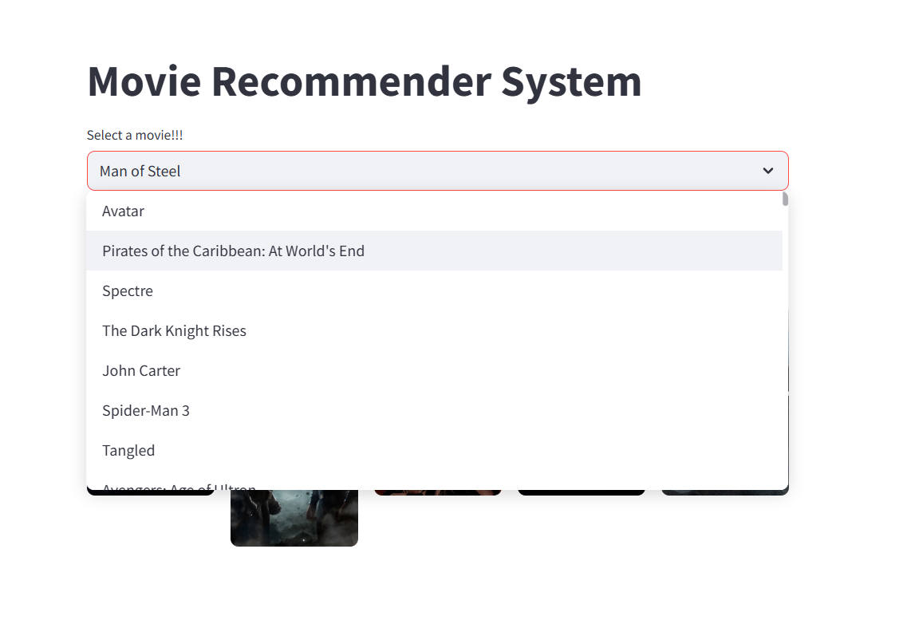
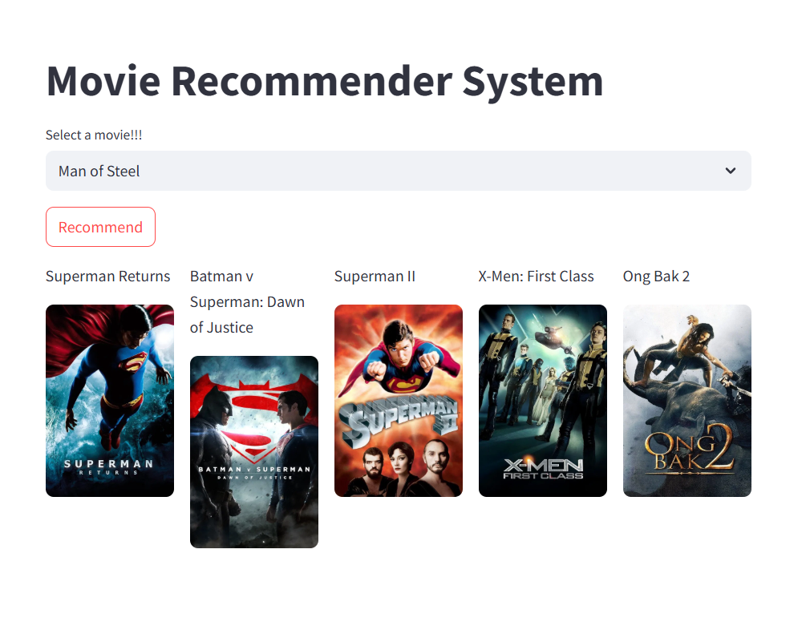
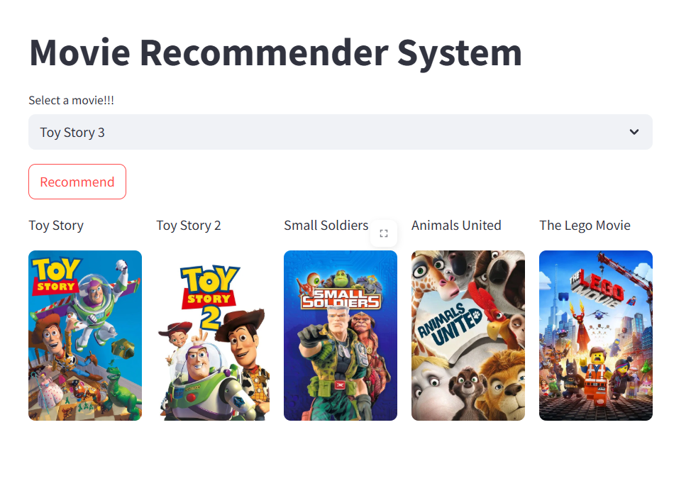

# 🎬 Movie Recommender System

Welcome to the **Movie Recommender**!  

This project is a content-based movie recommendation system built using the TMDB dataset, designed to help users find movies similar to their favorites.

---

## 💡 Overview

The system recommends similar movies based on metadata such as **genre, summary, actors, directors, and storyline**.  

We processed a dataset of **10,000 movies** from TMDB and selected important features to build a robust similarity model.

---

## 🗂️ Dataset

- **Source**: TMDB (The Movie Database) dataset
- **Size**: ~10,000 movies
- **Selected columns**:
  - Genre
  - Summary
  - Actors
  - Directors
  - Story

---

## ⚙️ Methodology

### ✨ Feature Selection & Preprocessing

- Chose important text-based columns (genre, summary, actors, directors, story).
- Cleaned and preprocessed text (lowercasing, removing stop words, etc.).
- Built a **vocabulary of top 5,000 words** from the combined text.

### 🔎 Vectorization

- Represented each movie in a **5,000-dimensional vector space** using the selected vocabulary.
- Used **cosine similarity** to measure distances between movie vectors.

### 🤝 Recommendation

- For each movie, identified **5 nearest neighbors** (movies with least cosine distance).
- Returned these as the top recommendations.

### 💻 Web Interface

- Built an interactive web app using **Streamlit**.
- Users can select or search for a movie, and instantly see similar movies suggested.

---

## 🖼️ Demo Screenshot

